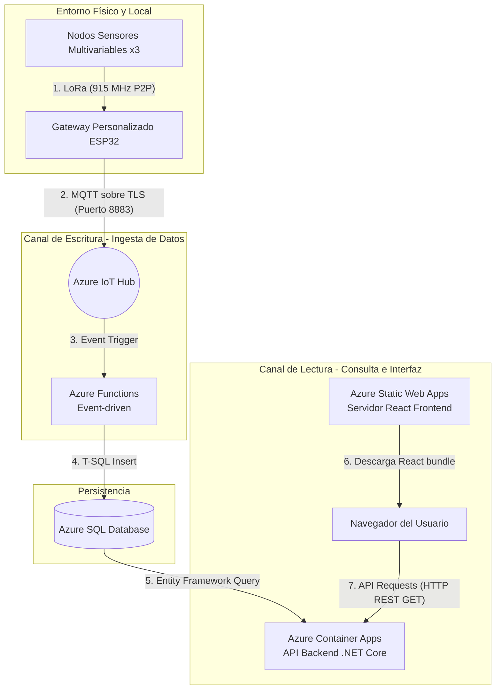

# Arquitectura e Infraestructura de Datos del Sistema IoT UTEC

Este documento detalla el flujo de datos de extremo a extremo (End-to-End) del sistema de monitoreo, alerta y mitigación ambiental, y explica detalladamente la función específica de **Azure Container Apps** dentro del ecosistema en la nube.

---

## 1. El Flujo de Datos del Sistema (Arquitectura CQRS)

El sistema está diseñado bajo el patrón **CQRS** (*Command Query Responsibility Segregation*), el cual separa físicamente la ruta por donde se guardan los datos (Escritura/Ingesta) de la ruta por donde se consultan (Lectura/Visualización). Esto garantiza alta velocidad y evita cuellos de botella.

### Paso a Paso del Recorrido del Dato:

1. **Captura y Control Local:** Los Nodos Sensores recopilan lecturas (CO₂, polvo, temperatura y humedad), computan la lógica de mitigación para activar o regular los extractores mediante PWM, y transmiten una trama de radio mediante el transceptor **LoRa E220** (915 MHz).
2. **Puente de Red (Edge):** El **Gateway ESP32** recibe la trama de radio, verifica su integridad, la transforma a formato **JSON** y la transmite vía Wi-Fi local hacia el internet público usando protocolo **MQTT sobre TLS (puerto 8883)**.
3. **Punto de Ingesta Nube:** **Azure IoT Hub** recibe la telemetría segura y dispara un evento inmediato.
4. **Procesamiento Serverless:** **Azure Functions** (desencadenado por evento) procesa y desempaqueta el JSON, y realiza una inserción directa a la base de datos **Azure SQL Database** mediante código T-SQL.
5. **Alojamiento de Interfaz:** Cuando el usuario ingresa a la plataforma, **Azure Static Web Apps** entrega al navegador los archivos estáticos de la aplicación (React/TypeScript).
6. **Consumo de la API:** El navegador web del usuario realiza peticiones HTTP REST GET para cargar gráficas históricas de sensores y configurar alertas. Estas solicitudes son recibidas y resueltas por **Azure Container Apps** (API Backend .NET Core), que consulta la base de datos **Azure SQL Database** y devuelve la información estructurada al usuario.

---

## 2. ¿Qué es Azure Container Apps y cuál es su función en tu Tesis?

**Azure Container Apps** es un servicio administrado en la nube diseñado para alojar aplicaciones y microservicios **contenedorizados (Docker)** con un esquema **Serverless** (sin servidor físico permanente).

### ¿Cuál es su función concreta en tu aplicación?
Abre las puertas de tu API Backend. El backend de tu aplicación web (desarrollado en C# y .NET Core) está empaquetado dentro de un contenedor Docker. **Azure Container Apps es el motor que ejecuta, protege y escala este contenedor backend.**

Cuando el frontend (React) necesita consultar datos históricos de CO₂ o polvo, le envía peticiones a una URL de la nube. **Container Apps recibe esa petición, ejecuta el código de tu backend para consultar a la base de datos SQL, y le devuelve las lecturas al navegador del usuario.**

---

## 3. ¿Por qué se usa Container Apps en lugar de otros servicios?

En arquitectura de software, existen alternativas como *Azure App Service* o *Azure Kubernetes Service (AKS)*. Container Apps fue elegido por cuatro razones fundamentales para tu investigación:

### A. Escalado a Cero (Costos 0 USD en Inactividad)
Este es el beneficio más importante. En un entorno académico, las consultas al dashboard no ocurren las 24 horas del día; ocurren durante las clases, pruebas o la sustentación de la tesis.
* **Cómo funciona:** Si nadie tiene abierto el dashboard web, Azure Container Apps apaga automáticamente el contenedor (escala a **0 réplicas**). En este estado de inactividad, **el costo de procesamiento es exactamente 0 USD**.
* Cuando un usuario ingresa a la página web y React envía una petición HTTP, Container Apps detecta el tráfico, enciende el contenedor en menos de 2 segundos (escala a **1 réplica**) de forma transparente, atiende la petición, y si pasa un tiempo sin tráfico, vuelve a apagarse.

### B. Ejecución de Contenedores Sin Complejidad
Para garantizar que el software backend se comporte exactamente igual en tu computadora de desarrollo que en la nube, se compila dentro de un contenedor Docker. 
* En lugar de tener que configurar y pagar un costoso e hipercomplejo clúster de Kubernetes (**AKS**), Container Apps te proporciona la tecnología de Kubernetes por debajo (incluyendo escalabilidad automática con KEDA e ingress virtual integrado) sin que tengas que administrar servidores, parches de sistema operativo o redes virtuales complejas.

### C. Aislamiento de Capas (CQRS)
Al separar la ingesta de telemetría (manejada por Azure Functions) de las consultas web (manejadas por Azure Container Apps):
* Si tus nodos sensores envían millones de tramas de datos por minuto, las funciones de Azure absorberán esa carga escribiendo en la base de datos sin interferir en la fluidez de la aplicación web. El usuario podrá navegar por el dashboard rápido y sin retrasos porque la API en **Container Apps** opera de manera aislada con recursos dedicados para la consulta.
